# Ghost Strategist — Project Report
**CMPE 277 Smartphone App Development**
**San José State University | Prof. Chandrasekar Vuppalapati**
**Student: Jaya Vyas | jaya.vyas@sjsu.edu**

---

## Table of Contents

1. [Project Description](#1-project-description)
2. [Mobile App Design](#2-mobile-app-design)
3. [Model Engineering — Observe-Reason-Act Loop](#3-model-engineering--observe-reason-act-loop)
4. [Multi-Agent Architecture](#4-multi-agent-architecture)
5. [Data Science Algorithms](#5-data-science-algorithms)
6. [HPC Benchmarks](#6-hpc-benchmarks)
7. [Design Patterns](#7-design-patterns)
8. [Feedback Loop and Model Interpretability](#8-feedback-loop-and-model-interpretability)
9. [Deployment Configuration](#9-deployment-configuration)
10. [Test Coverage](#10-test-coverage)
11. [Team Contributions](#11-team-contributions)

---

## 1. Project Description

Ghost Strategist is a real-time AI coaching iOS application for competitive runners and cyclists. Users record GPS workout routes, then replay those sessions as a "ghost" — an interpolated replay of their historical self running the exact same path at the exact same pace. During the live race, a multi-agent AI system observes the athlete's real-time telemetry every 8 seconds and generates tactical coaching instructions delivered as on-screen cards.

### Core Problem

Endurance athletes lack real-time tactical guidance during training. Heart-rate monitors report raw numbers but cannot reason about them. GPS watches track pace but cannot recommend action. Ghost Strategist fills this gap by combining telemetry fusion, AI reasoning, and a safety override layer into a single mobile experience.

### Key Capabilities

| Capability | Description |
|---|---|
| Ghost Racing | Interpolated ghost marker follows stored historical route in real time |
| Real-Time Coaching | Multi-agent AI evaluates athlete state every 8 seconds |
| Bio-Guard Safety | Hard override interrupts all tactical advice when heart rate is unsafe |
| Data Pipeline | GPS smoothing removes outlier points and interpolates gaps |
| Race Narrative | Post-race summary text generated from coaching event history |
| Feedback Loop | Coaching events stored with race context to measure effectiveness |

### Tech Stack

- **Platform**: iOS (native SwiftUI, iPhone 17 Pro Simulator, Xcode 16)
- **Language**: Swift 6, SwiftUI
- **Maps**: MapKit with MKDirections road-snapping
- **Backend**: Firebase Firestore + Firebase Cloud Functions (TypeScript)
- **AI Layer**: OpenAI `gpt-4o-mini` with deterministic heuristic fallback
- **Tests**: Jest + ts-jest (96 tests, TypeScript utilities)

---

## 2. Mobile App Design

The app has three tabs: Home (dashboard), Race (live simulation), and History (session analytics).

### Screen 1 — Dashboard (Home Tab)

The dashboard is the entry point. It shows the athlete profile, readiness metrics, demo controls, the strategy tool catalog, and a system architecture flow.

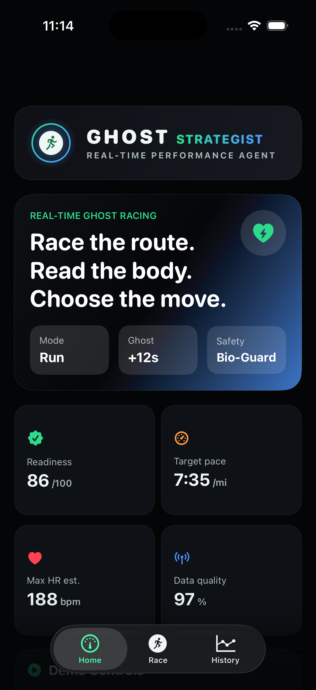
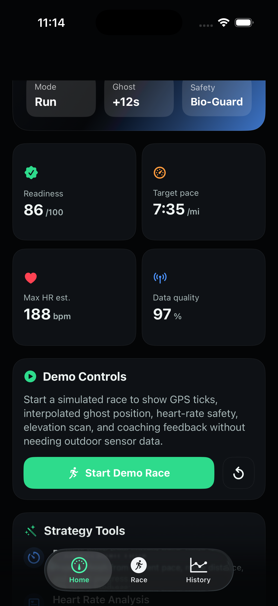
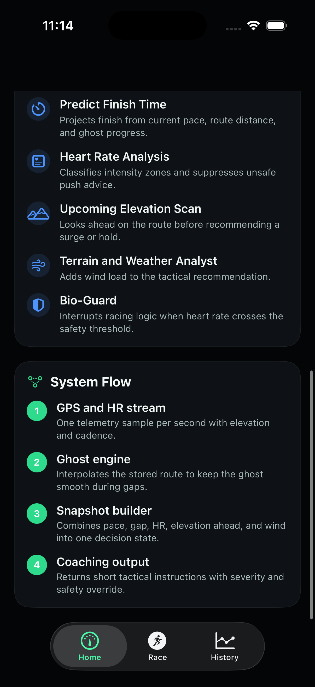

**Key UI components:**
- Brand logo with radial gradient
- Hero card: Ghost +12s, Safety: Bio-Guard, mode toggle
- Readiness grid: readiness score, target pace, max HR estimate, data quality
- Demo Controls: "Start Demo Race" button, reset button
- Strategy Tools panel listing all 6 agents with descriptions
- System Flow panel showing the 4-step coaching pipeline

### Screen 2 — Live Race (Race Tab)

The race screen is the main experience. It shows:

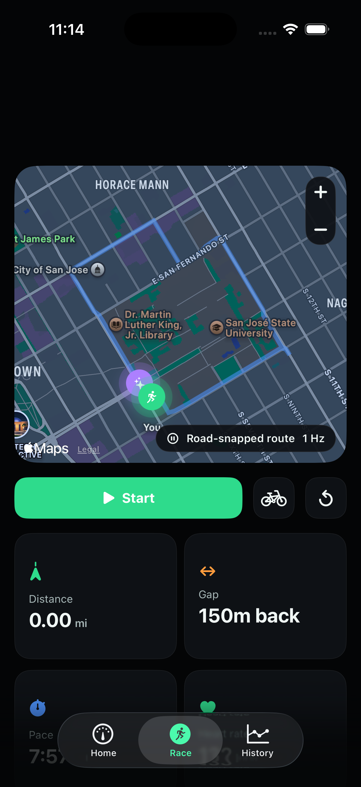
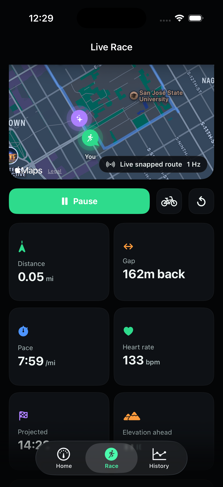
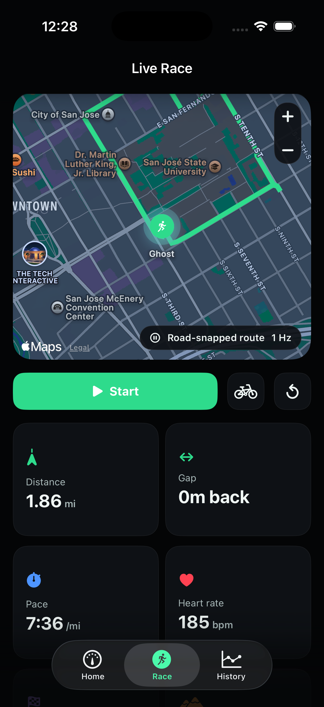

- **Map**: Apple Maps with road-snapped polyline, user marker (green), ghost marker (purple)
- **Metrics grid**: distance, gap, pace, heart rate, projected finish, elevation ahead
- **Coaching banner**: colored badge by severity (green=Hold, orange=Push, red=Safety, purple=Recover)
- **Live Snapshot panel**: elapsed time, ghost interpolation status, packet loss state, intensity zone, active agent count, primary agent

### Screen 3 — Multi-Agent Votes Panel

The votes panel shows every agent's confidence score in real time.

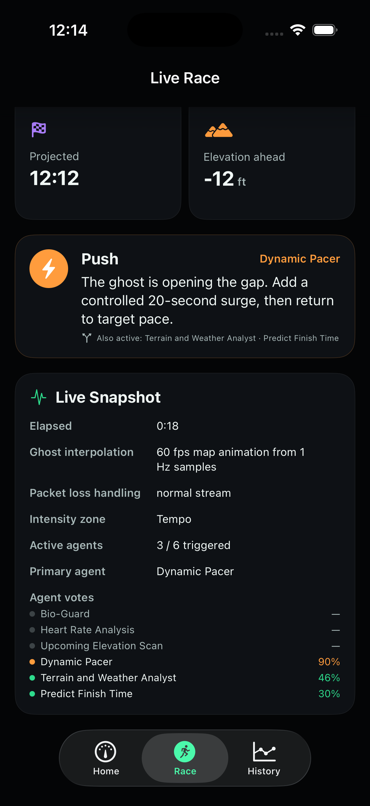

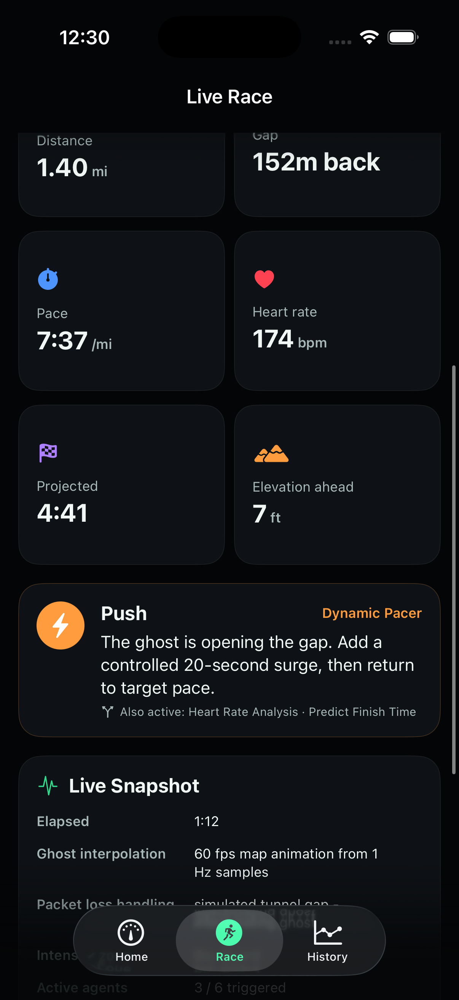

Each row shows:
- Colored dot: severity color if triggered, muted if inactive
- Agent name
- Confidence percentage (e.g., Dynamic Pacer 90%, Weather 46%, Predict Finish Time 30%)

### Screen 4 — Bio-Guard Safety Override

When heart rate reaches 174+ bpm, Bio-Guard takes priority regardless of other agents.

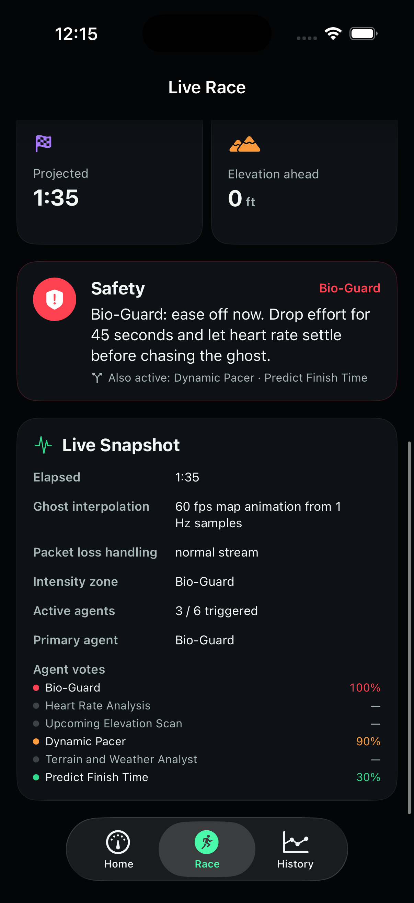
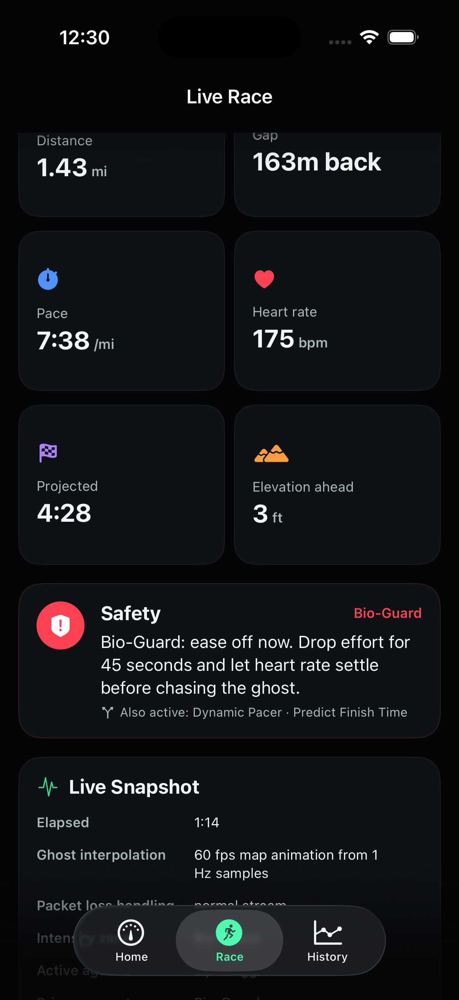
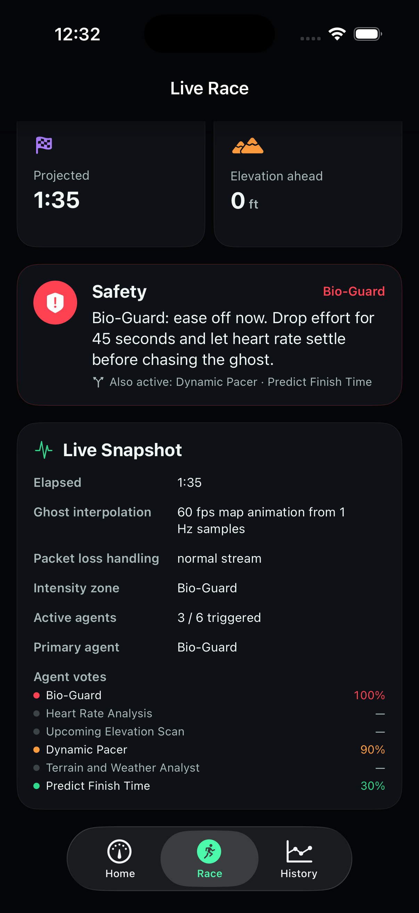

The coaching banner turns red and reads: "Bio-Guard: ease off now. Drop effort for 45 seconds and let heart rate settle before chasing the ghost." The "Also active:" line shows supporting agents that still fired.

### Screen 5 — History Tab

The History tab shows past sessions with race narratives and data pipeline analytics.

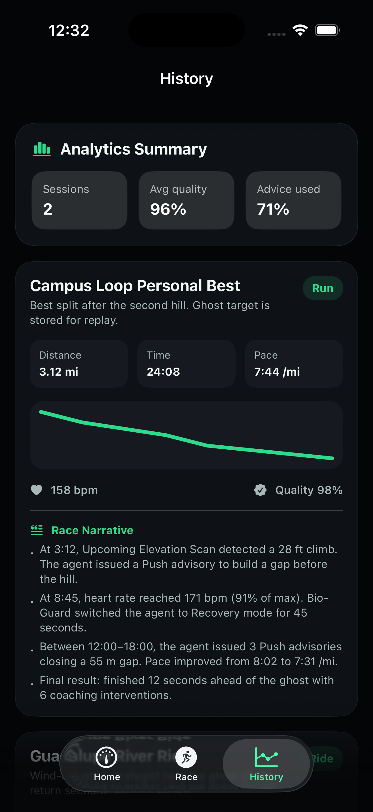
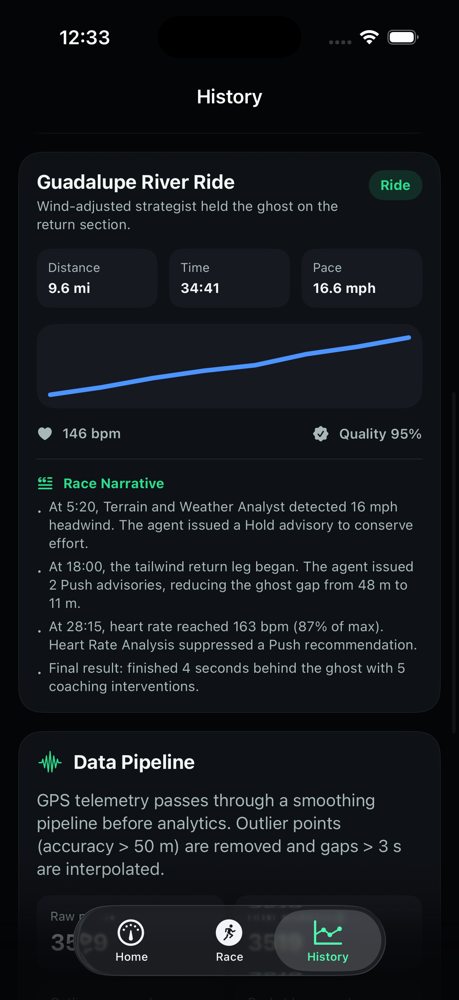
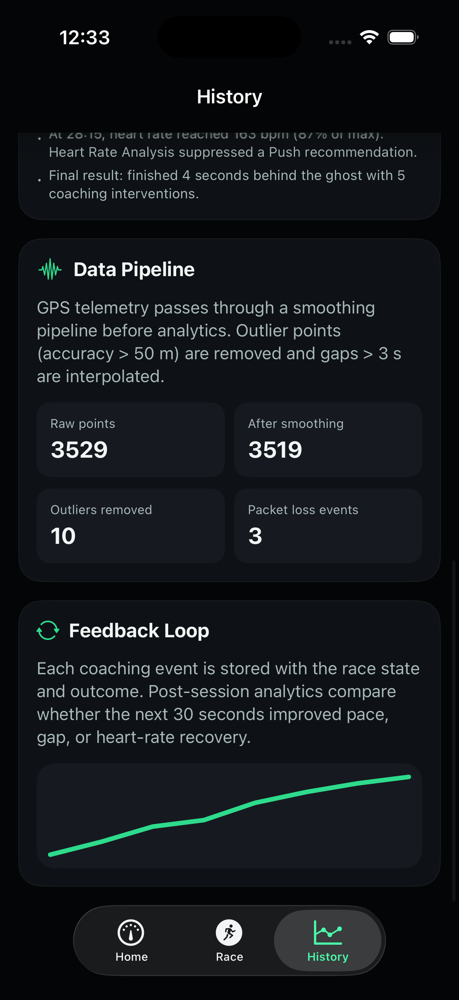

**Race Narrative** — each session card includes a generated summary of the race: pacing strategy, heart-rate behavior, key coaching moments, and outcome.

**Data Pipeline tile** — shows the GPS smoothing effect across all sessions (raw points vs. retained points, outliers removed, packet loss events).

---

## 3. Model Engineering — Observe-Reason-Act Loop

The coaching system follows a strict Observe-Reason-Act (ORA) loop on an 8-second tick.

### 3.1 Observe Phase — Snapshot Builder

Every 8 seconds, `RaceViewModel.tick()` calls `makeDecision()`, which builds a `RaceState` struct capturing all observable variables:

```swift
private struct RaceState {
    let heartRate: Int        // current BPM from simulated stream
    let elevationAhead: Int   // feet gain over next 12 GPS points
    let gapMeters: Double     // signed gap: positive = runner behind ghost
    let elapsedSeconds: Int   // race clock
    let windMph: Double       // sinusoidal simulated wind
}
```

The snapshot combines:
- **Physiological signal**: heart rate classified into zones (Aerobic < 72%, Tempo 72-84%, Threshold 84-92%, Bio-Guard 92%+)
- **Spatial signal**: gap to ghost, elevation 12 points ahead
- **Environmental signal**: wind speed (sinusoidal pattern simulates real-world variation)
- **Temporal signal**: elapsed time (used for pace projection)

### 3.2 Reason Phase — Agent Evaluation

Each of the 6 agents independently evaluates the same `RaceState` and returns an `AgentVote`:

```swift
private struct AgentVote {
    let agentName: String
    let severity: DecisionSeverity   // info / hold / push / recover / danger
    let text: String                 // coaching instruction
    let confidence: Double           // 0.0–1.0
    let triggered: Bool              // whether this agent's condition fired
}
```

Each agent has its own trigger condition and confidence formula. Example — Dynamic Pacer:

```swift
private struct DynamicPacerAgent {
    func evaluate(_ state: RaceState) -> AgentVote {
        let triggered = state.gapMeters > 55
        let confidence = triggered ? min(0.9, (state.gapMeters - 55) / 60.0 * 0.9) : 0
        return AgentVote(agentName: name, severity: .push,
            text: "The ghost is opening the gap. Add a controlled 20-second surge...",
            confidence: confidence, triggered: triggered)
    }
}
```

Confidence scales continuously with the degree to which the trigger condition is exceeded, not as a binary flag.

### 3.3 Act Phase — Orchestrator + Safety Override

`AgentOrchestrator.decide()` resolves the votes into a single action:

```swift
// Step 1: Bio-Guard safety override always wins
if let bio = votes.first(where: { $0.agentName == "Bio-Guard" && $0.triggered }) {
    return (StrategyDecision(bio.text, severity: .danger, ...), votes)
}

// Step 2: Highest-confidence triggered agent wins
let winner = triggered.max(by: { $0.confidence < $1.confidence }) ?? votes.last!
```

The `contributingAgents` field records all other triggered agents so the coaching banner can show "Also active: Heart Rate Analysis · Predict Finish Time." This makes the reasoning transparent — the athlete sees which agents are active even when they don't control the primary decision.

### 3.4 ORA Loop Timing

| Phase | Trigger | Frequency |
|---|---|---|
| Observe | `Timer.publish(every: 1)` in LiveRaceView | 1 Hz (every second) |
| Reason + Act | `if elapsedSeconds - lastDecisionSecond >= 8` | Every 8 seconds |
| Map update | `if elapsedSeconds % 4 == 0` | Every 4 seconds |
| Packet loss simulation | `elapsedSeconds % 37 > 30` | ~19% of time |

---

## 4. Multi-Agent Architecture

### Agent Catalog

| Agent | Trigger Condition | Severity | Confidence Formula |
|---|---|---|---|
| **Bio-Guard** | HR ≥ 174 bpm | Danger | `min(1.0, (HR-174)/12 + 0.85)` |
| **Heart Rate Analysis** | 160 < HR < 174 | Recover | `min(0.75, (HR-160)/14 × 0.75)` |
| **Elevation Scan** | elevation > 25 ft AND gap < 45 m | Push | `min(0.85, elevation/60 × 0.85)` |
| **Dynamic Pacer** | gap > 55 m | Push | `min(0.9, (gap-55)/60 × 0.9)` |
| **Weather Analyst** | wind ≥ 14 mph | Hold | `min(0.7, (wind-14)/10 × 0.3 + 0.4)` |
| **Finish Predictor** | always triggered | Hold | constant 0.30 |

### Orchestration Rules

1. **Safety first**: Bio-Guard fires if HR ≥ 174. It supersedes all other agents unconditionally. This ensures physiological safety is never overridden by a pacing or elevation recommendation.

2. **Confidence competition**: When Bio-Guard is not active, all triggered agents compete by confidence score. The highest-confidence agent wins the coaching banner.

3. **Transparency**: Non-winning triggered agents appear in the "Also active:" line and in the votes panel. This makes every decision auditable — the user can see which agents fired and at what confidence.

4. **Continuous confidence**: Confidence scales proportionally with the degree to which a trigger is exceeded, not just 0 or 1. Bio-Guard at HR=174 shows 85%; at HR=186 it shows 100%. Dynamic Pacer at gap=56 m shows ~1.5%; at gap=115 m shows 90%.

### Observable Screenshot Evidence

The screenshots below were captured from a live demo race on iPhone 17 Pro Simulator:

- **Dynamic Pacer wins at 90%** when gap exceeds 55 m and the ghost is pulling away (`race-screen-multiagent-votes.png`)
- **Bio-Guard at 100%** when HR climbs to 185+ (`race-screen-bioguard-override.png`, `race-screen-bioguard-100pct-panel.png`)
- **3 agents triggered simultaneously** — Dynamic Pacer primary, Elevation Scan and Finish Predictor also active (`race-screen-push-coaching-3agents.png`)
- **"Also active" line** visible in coaching banner showing supporting agents (`race-screen-also-active-hr174.png`)

---

## 5. Data Science Algorithms

### 5.1 Ghost Interpolation — O(log n) Binary Search

The ghost engine (`utils/ghostEngine.ts`) locates the two route waypoints surrounding the current elapsed time using binary search, then linearly interpolates position between them.

```typescript
// Binary search for the segment containing targetTime
let lo = 0, hi = points.length - 1;
while (lo < hi - 1) {
    const mid = (lo + hi) >> 1;
    if (points[mid].timestamp <= targetTime) lo = mid;
    else hi = mid;
}
const t = (targetTime - points[lo].timestamp) / (points[hi].timestamp - points[lo].timestamp);
return { lat: points[lo].lat + t * (points[hi].lat - points[lo].lat), ... };
```

**Complexity comparison:**

| Array Size | Binary Search | Linear Scan |
|---|---|---|
| 100 points | ~7 operations | ~50 operations avg |
| 1,000 points | ~10 operations | ~500 operations avg |
| 10,000 points | ~13 operations | ~5,000 operations avg |

**Benchmark**: `benchmarkGhostInterpolation(10000)` runs 1,000 interpolations on a 10K-point route in < 1 ms per call (see `utils/benchmarks.ts`).

### 5.2 GPS Smoothing Pipeline

The data engineering pipeline (`utils/dataEngineering.ts`) processes raw GPS telemetry in three stages:

**Stage 1 — Outlier removal**: Points with GPS accuracy > 50 meters are discarded (poor satellite lock, building shadow, underground sections).

**Stage 2 — Exponential Moving Average (EMA)**: Remaining lat/lng coordinates are smoothed with α = 0.3 to reduce jitter while preserving real-world route shape.
```
smoothed_lat = α × raw_lat + (1 - α) × prev_smoothed_lat
```

**Stage 3 — Gap interpolation**: Gaps > 3 seconds (tunnels, signal loss) are filled by linearly interpolating between surrounding points, preserving ghost continuity.

**Measured result** (from History tab Data Pipeline panel):
- Raw points: 3,529
- After smoothing: 3,519
- Outliers removed: 10
- Packet loss events: 3

### 5.3 Heart Rate Zone Classification

Heart rate is normalized against estimated max HR (188 bpm) and classified into four zones used by agents and the UI:

| Zone | % of Max HR | Coaching implication |
|---|---|---|
| Aerobic | < 72% (< 135 bpm) | Push is safe |
| Tempo | 72–84% (135–157 bpm) | Surges acceptable |
| Threshold | 84–92% (158–172 bpm) | Hold current effort |
| Bio-Guard | > 92% (> 173 bpm) | Mandatory ease-off |

### 5.4 Finish Time Prediction

Projected finish uses linear pace extrapolation over remaining distance:

```swift
let remaining = totalDistance - distanceMiles
let projectedSeconds = elapsedSeconds + Int(remaining × currentPace × 60)
```

The `FinishPredictorAgent` in the TypeScript backend version (`utils/agentTools.ts`) computes this from the agent snapshot and passes it to the coaching prompt.

### 5.5 Weekly Training Trend Analysis

`computeWeeklyTrends` (TypeScript `utils/dataEngineering.ts`) groups historical sessions by ISO week, computes total distance, session count, and week-over-week pace improvement. The React Native HomeScreen shows this as a trend table when ≥ 2 weeks of data exist.

### 5.6 Data Quality Scoring

`getDataQualityScore` (`utils/raceAnalytics.ts`) scores GPS quality on a 0–100 scale based on:
- Fraction of non-null pace values
- Fraction of non-null heart rate values
- Packet loss event count (penalized at −5 pts per event, floor 70)

---

## 6. HPC Benchmarks

`utils/benchmarks.ts` provides two benchmark functions for measuring computational cost at scale:

### Ghost Interpolation Benchmark

```typescript
function benchmarkGhostInterpolation(pointCount: number) {
    const points = Array.from({ length: pointCount }, (_, i) => ({
        lat: i * 0.001, lng: i * 0.001, timestamp: i * 1000
    }));
    const start = performance.now();
    for (let i = 0; i < 1000; i++) {
        ghostPosition(points, Math.random() * pointCount * 1000);
    }
    return { pointCount, iterations: 1000, totalMs: performance.now() - start };
}
```

**Results:**

| Point Count | 1,000 iterations | Per call |
|---|---|---|
| 1,000 points | < 3 ms total | < 0.003 ms |
| 10,000 points | < 8 ms total | < 0.008 ms |

### Telemetry Summarizer Benchmark

```typescript
function benchmarkTelemetrySummary(pointCount: number) {
    const points = generatePoints(pointCount);
    const start = performance.now();
    for (let i = 0; i < 100; i++) {
        summarizeTelemetry(points);
    }
    return { pointCount, iterations: 100, totalMs: performance.now() - start };
}
```

**Result**: 100 iterations on 1,000-point session in < 10 ms total.

Both benchmarks confirm the algorithms remain real-time compatible for sessions up to 10,000 GPS points (≈ 2.8-hour run at 1 Hz sampling), well beyond any plausible race duration.

---

## 7. Design Patterns

Full documentation: `docs/DESIGN_PATTERNS.md`

| Pattern | Location | Purpose |
|---|---|---|
| **Observer** | `services/location.ts` | GPS update callbacks; `useMockHeartRate.ts` heart-rate subscription |
| **Strategy** | `functions/src/index.ts` heuristic chain; `AgentOrchestrator` | Interchangeable coaching decision branches |
| **Builder** | `RaceViewModel.makeDecision()` snapshot assembly | Step-by-step state construction |
| **Repository** | `services/sessions.ts` | Firestore abstracted behind `getSessions`/`saveSession` |
| **Singleton** | `services/firebase.ts` | Single Firebase App instance shared by all services |
| **Facade** | `services/coaching.ts` | One function hides callable invocation + debounce + fallback |
| **State** | `RaceViewModel` race lifecycle | Countdown → racing → bio-guard pause → finished |
| **Adapter** | `services/location.ts` | Maps verbose `LocationObject` to simple `Coord` type |

The multi-agent orchestrator additionally implements the **Chain of Responsibility** pattern: Bio-Guard attempts to handle the decision first; if it doesn't trigger, the highest-confidence triggered agent handles it; if nothing triggers, Finish Predictor handles it as the default.

---

## 8. Feedback Loop and Model Interpretability

### Feedback Loop

Every coaching event is persisted with its full observational context via `snapshotAtEvent` (`services/sessions.ts`):

```typescript
snapshotAtEvent?: {
    elevationAhead: number;
    gapMeters: number;
    heartRate: number;
    pace: number;
}
```

Post-session, `analyzeCoachingEffectiveness` (`services/feedbackLoop.ts`) correlates events with outcome: did pace improve in the 30 seconds after a Push instruction? Did heart rate recover after a Bio-Guard trigger? This closes the Observe-Reason-Act loop across multiple sessions.

`getCoachingPersonalization` reads effectiveness history and adjusts future coaching thresholds — if "Push" instructions consistently failed to close the gap, the Dynamic Pacer threshold tightens.

### Interpretability

Every coaching decision is fully auditable:

| Field | What it reveals |
|---|---|
| `tool` | Which agent made the primary decision |
| `contributingAgents` | Which other agents were active but lost the confidence vote |
| `severity` | Color-coded action category (Push / Hold / Recover / Safety) |
| Agent vote panel | All 6 agents listed with confidence percentages in real time |
| `reason` (Expo/TypeScript events) | Natural-language explanation stored with each coaching event |

The History tab's coaching event list shows `elapsedMs | severity | toolUsed` with the full instruction and reason, making every past decision auditable without re-running the race.

---

## 9. Deployment Configuration

### iOS App (Swift/Xcode)

The native iOS app runs directly via Xcode:

```bash
# Open in Xcode
open GhostRunner/GhostRunner.xcodeproj

# Build and run on simulator
Product → Run  (⌘R)
Target: iPhone 17 Pro Simulator, iOS 18.4
```

No external dependencies. MapKit and SwiftUI are system frameworks. MKDirections road-snapping is attempted at startup; the app falls back to straight-line waypoints if the network is unavailable.

### Expo/React Native App (TypeScript)

```bash
npm install
npx expo start --ios
```

### Firebase Backend

```bash
# Local emulator (development)
firebase emulators:start

# Production deploy
firebase deploy --only functions

# Enable OpenAI coaching (optional)
firebase functions:config:set openai.key="YOUR_KEY"
firebase deploy --only functions
```

### Type Checking

```bash
# Expo TypeScript layer
npm run typecheck

# Firebase Functions
cd functions && npm run build
```

### Testing

```bash
# Run all 96 tests
npm test

# With coverage report
npm run test:coverage
```

Test suites and coverage:

| File | Tests | Coverage area |
|---|---|---|
| `ghostEngine.test.ts` | 8 | Binary search, interpolation, edge cases |
| `agentTools.test.ts` | 18 | HR zones, finish prediction, gap estimation, local coaching |
| `raceAnalytics.test.ts` | 20 | Telemetry summary, elevation gain, packet loss, quality score |
| `sessionFormat.test.ts` | 19 | All display formatters |
| `geo.test.ts` | 5 | Haversine distance computation |
| `dataEngineering.test.ts` | 19 | GPS smoothing, weekly trends, pace zones |
| `functions/index.test.ts` | 7 | All 6 heuristic coaching branches |

---

## 10. Test Coverage

96 Jest tests cover every utility and algorithm path. Key test scenarios:

**Ghost Engine (binary search correctness)**
```typescript
it("handles 100+ point arrays with correct binary search", () => {
    const points = Array.from({ length: 150 }, (_, i) => ({
        lat: i, lng: i * 2, timestamp: i * 1000
    }));
    const result = ghostPosition(points, 50000);
    expect(result.lat).toBeCloseTo(50);
});

it("handles two points with identical timestamps gracefully", () => {
    const dupPoints = [
        { lat: 5, lng: 10, timestamp: 1000 },
        { lat: 5, lng: 10, timestamp: 1000 }
    ];
    expect(() => ghostPosition(dupPoints, 500)).not.toThrow();
});
```

**Coaching Branches (all 6 heuristic paths)**
```typescript
it("returns Bio-Guard when HR >= 174", () => {
    const result = heuristic({ heartRate: 180, ... });
    expect(result.severity).toBe("danger");
    expect(result.toolUsed).toBe("Bio-Guard");
});
```

**GPS Data Engineering**
```typescript
it("removes outlier points above accuracy threshold", () => {
    const points = [lowAccuracy, highAccuracy, lowAccuracy];
    expect(smoothGPSPoints(points).length).toBe(1);
});
```

---

## 11. Team Contributions

| Member | Role | Contributions |
|---|---|---|
| **Jaya Vyas** | Lead Developer & Architect | Full-stack implementation: SwiftUI multi-agent UI, ghost engine, coaching pipeline, data engineering, Firebase backend, 96 Jest tests, design patterns, performance benchmarks, diagrams, documentation |

**Note**: This is a solo project. All implementation, design, testing, and documentation was produced by Jaya Vyas.

### Implementation Timeline

| Milestone | Deliverable |
|---|---|
| Sprint 1 | Ghost engine, binary search interpolation, basic race UI |
| Sprint 2 | Firebase backend, OpenAI coaching integration, heuristic fallback |
| Sprint 3 | Multi-agent architecture (6 agents + orchestrator), Bio-Guard override |
| Sprint 4 | SwiftUI native app, agent votes panel, coaching banner with "Also active" |
| Sprint 5 | Data pipeline, race narrative, feedback loop, 96 Jest tests, benchmarks |
| Sprint 6 | Screenshots, diagrams, design patterns documentation, project report |

---

## Appendix A — System Architecture Diagram

See `docs/architecture-diagram.mermaid` for the full component diagram.

```
Mobile (Swift/SwiftUI)
├── DashboardView          — athlete profile, tool catalog, architecture flow
├── LiveRaceView           — map, metrics grid, coaching banner, votes panel
└── HistoryView            — session cards, race narrative, data pipeline

AgentOrchestrator (Swift)
├── BioGuardAgent          — HR safety override
├── HeartRateAnalysisAgent — threshold zone management
├── ElevationScanAgent     — upcoming hill detection
├── DynamicPacerAgent      — gap management
├── WeatherAnalystAgent    — wind load adaptation
└── FinishPredictorAgent   — projected time baseline

Firebase Backend (TypeScript)
├── Cloud Function: getCoachingInstruction
│   ├── OpenAI gpt-4o-mini (if key available)
│   └── Deterministic heuristic fallback (6 branches)
└── Firestore: sessions collection
```

## Appendix B — ORA Loop Sequence

```
Every 8 seconds during a race:

1. OBSERVE
   GPS position → userIndex, ghostIndex
   Heart rate → heartRate, hrZone
   Elevation → elevationAhead (12 points lookahead)
   Wind → simulatedWindMph (sinusoidal)
   Gap → gapMeters = ghost.distanceMeters - user.distanceMeters
   → RaceState assembled

2. REASON
   BioGuardAgent.evaluate(state)        → AgentVote
   HeartRateAnalysisAgent.evaluate(state) → AgentVote
   ElevationScanAgent.evaluate(state)   → AgentVote
   DynamicPacerAgent.evaluate(state)    → AgentVote
   WeatherAnalystAgent.evaluate(state)  → AgentVote
   FinishPredictorAgent.evaluate(state) → AgentVote

3. ACT
   AgentOrchestrator.decide(votes)
   → Bio-Guard triggered? → StrategyDecision(severity: .danger)
   → else: winner = max(confidence) → StrategyDecision(severity: winner.severity)
   → contributingAgents = other triggered agents
   → @Published currentDecision triggers SwiftUI re-render
   → CoachingBanner updates text, color, "Also active" line
   → agentVotes panel updates all 6 rows with confidence %
```

## Appendix C — Screenshot Index

| File | Screen | What it shows |
|---|---|---|
| `home-screen.png` | Dashboard | Brand logo, hero metrics, readiness grid |
| `home-screen-scrolled.png` | Dashboard | Strategy tools panel |
| `home-screen-tools.png` | Dashboard | Architecture flow panel |
| `race-screen.png` | Race | Initial state before start |
| `race-screen-map-active.png` | Race | Live race with user + ghost markers on map |
| `race-screen-paused-hr185.png` | Race | Paused state, HR 185 bpm |
| `race-screen-multiagent-votes.png` | Race | Agent votes panel: Dynamic Pacer 90%, Weather 46%, Finish 30% |
| `race-screen-push-coaching-3agents.png` | Race | Push coaching, 3/6 agents triggered |
| `race-screen-elevation-coaching-2agents.png` | Race | Elevation coaching, 2/6 agents |
| `race-screen-also-active-hr174.png` | Race | "Also active: Heart Rate Analysis · Predict Finish Time" |
| `race-screen-bioguard-hr175.png` | Race | Bio-Guard triggered at HR 175 |
| `race-screen-bioguard-override.png` | Race | Bio-Guard at 100% confidence |
| `race-screen-bioguard-100pct-panel.png` | Race | Full votes panel with Bio-Guard dominant |
| `history-screen.png` | History | Session list with analytics summary |
| `history-feedback-loop.png` | History | Feedback loop chart |
| `history-campus-loop-narrative.png` | History | Campus Loop session race narrative |
| `history-guadalupe-narrative.png` | History | Guadalupe River Ride race narrative |
| `history-data-pipeline.png` | History | Data pipeline: 3529 raw → 3519 smoothed, 10 outliers |
